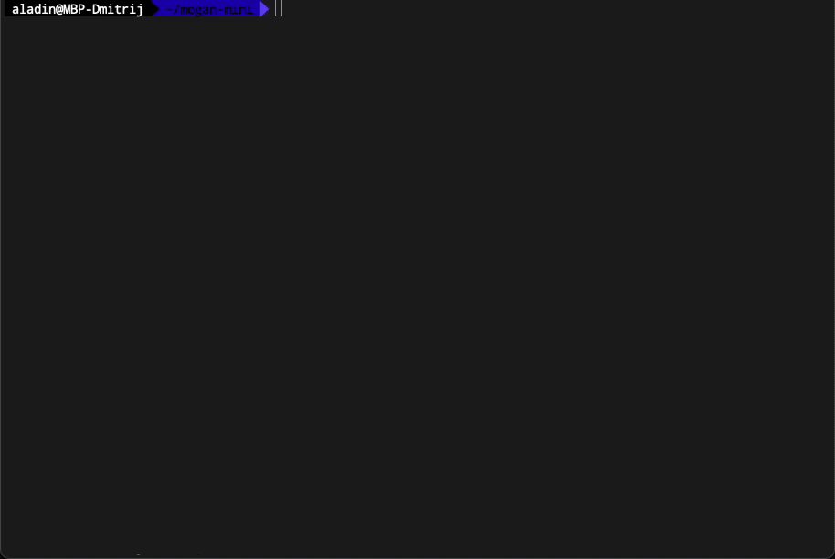

# mogan-mini

mogan-mini implements a local Editor of the Multidimensional Open Gnoseological Active Network (MOGAN) on macOS, Linux, and Windows.

## Development

- [Install Go](https://go.dev/)
- Run `go run cmd/mogan/main.go`
