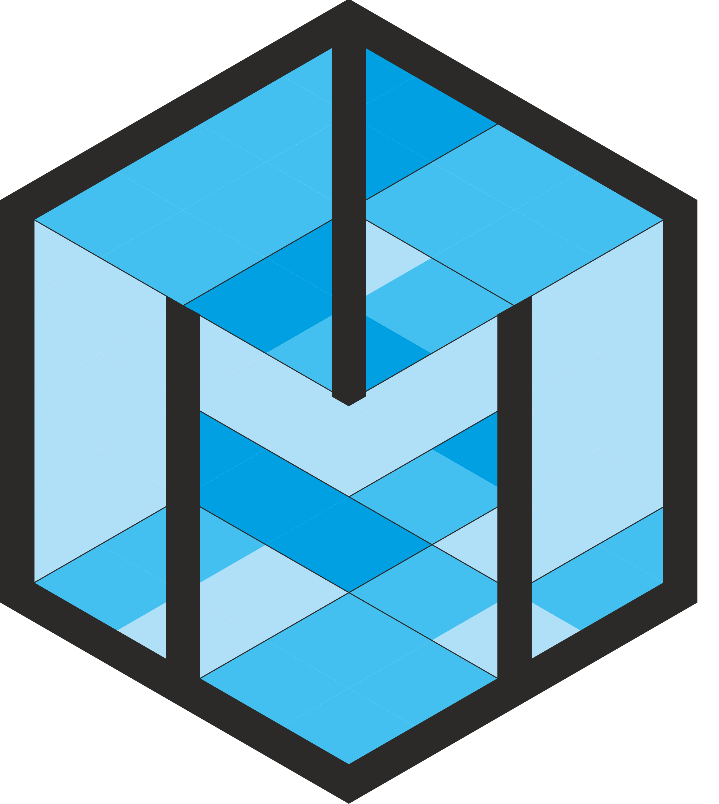
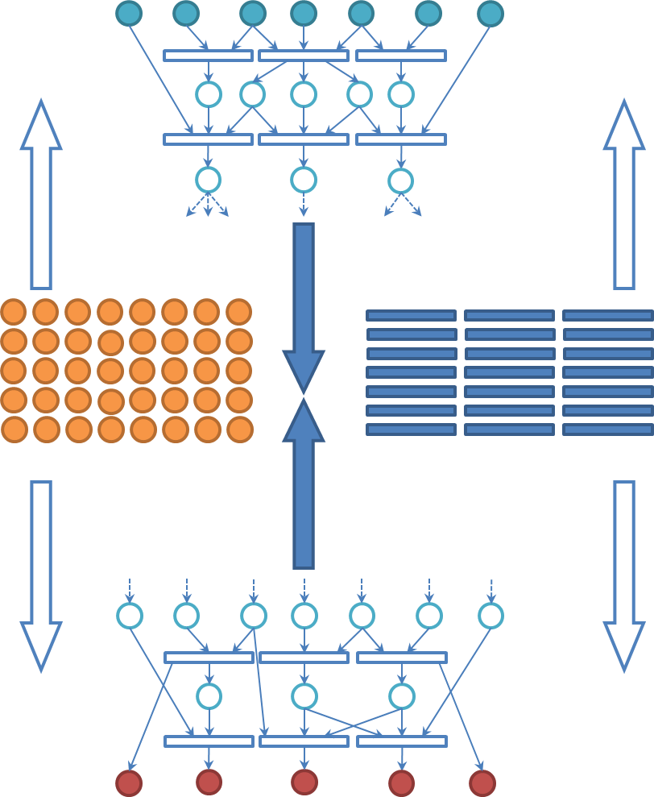
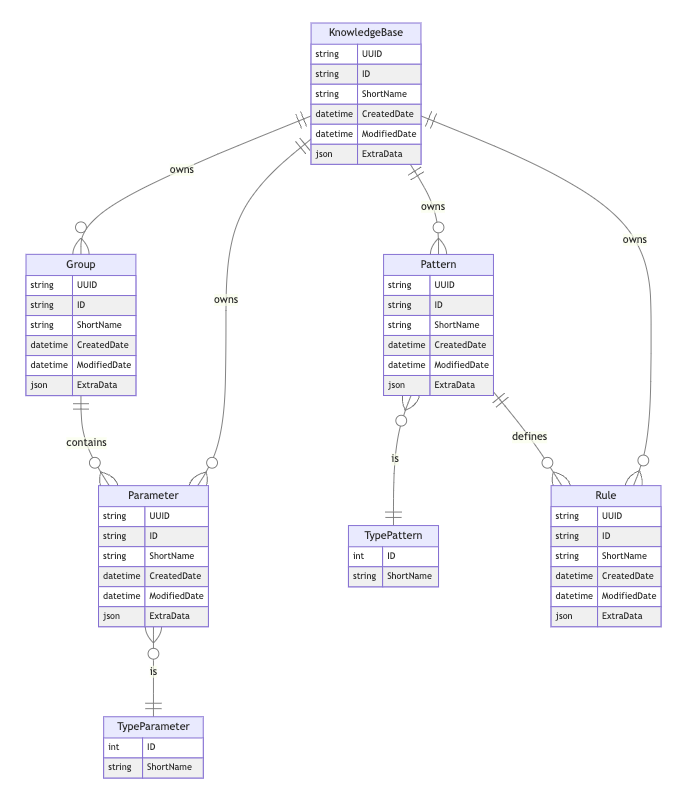

<style>
img[alt~="center"] {
  display: block;
  margin: 0 auto;
}
code {
    background: #000;
}
pre {
    background: #000;
}
</style>

# Редактор многомерной открытой гносеологической активной сети

<style scoped>
h1 {
    font-size: 1.4rem;
}
h2 {
    font-size: 1rem;
}
</style>



## Проект CLI

**Аладин** Дмитрий Владимирович

---

# Основа проекта

В основе проекта лежит сервис, который был разработан в спринте 5-6.

Репозиторий проекта: https://github.com/anondigriz/mogan-editor

Сервис предоставляет возможности по хранению пользовательских баз знаний и их редактирований.

Сервис имеет SSO на основе [Keycloak](https://www.keycloak.org/)

---

# Что такое "база знаний"?



**Продукционная база знаний** - это модель представления знаний, основанная на правилах, позволяет представить знание в виде предложений типа:

```shell
Если (условие), то (действие)
```

---

# Предлагаемый CLI

В рамках заключительных спринтов предлагается сделать CLI, который будет предоставлять пользователю:

1. Работать с **локальной версией базы знаний** (хранить и редактировать);
2. **Безопасно синхронизировать** базу знаний с внешним сервисом;
3. **Решать конфликты**, возникающие при синхронизации базы знаний.

---

# Основные трудности

<style scoped>
h1 {
    font-size: 1.2rem;
}
h2 {
    font-size: 1rem;
}
p {
    font-size: 0.8rem;
}
li {
    font-size: 0.8rem;
}
</style>

## 1. База знаний хранится в множестве таблиц



На стороне внешнего сервиса база знаний пользователей хранятся в нескольких таблицах.

Поэтому требуется:

1. Разработать эффективный метод синхронизации между CLI и внешним сервисом;
2. Обеспечить версионируемость баз знаний.

---

# Основные трудности

<style scoped>
h1 {
    font-size: 1.2rem;
}
h2 {
    font-size: 1rem;
}
p {
    font-size: 0.8rem;
}
li {
    font-size: 0.8rem;
}
</style>

## 2. Обеспечить удобный интерфейс по работе с локальными базами знаний

Основных структур в базе знаний четыре: логические правила; паттерны, по которым строятся правила; параметры; группы параметров.

Необходимо обеспечить понятный и наглядный интерфейс взаимодействия с базой знаний.

При решении данной задачи предлагается обратить внимание на опыт работы с CLI SQLite, CLI Mongo и CLI PostgreSQL.

---

# Основные трудности

<style scoped>
h1 {
    font-size: 1.2rem;
}
h2 {
    font-size: 1rem;
}
p {
    font-size: 0.8rem;
}
li {
    font-size: 0.8rem;
}
</style>

## 3. Обеспечить понятные способы разрешения конфликтов версий

Так как структура базы знаний декомпозирована по нескольким таблицам, то при синхронизации локальной версии базы знаний с удаленной неумолимо будут возникать конфликты.

Необходимо обеспечить способы разрешения конфликтов, чтобы обезопасить пользователя от неожиданной потери данных.

При решении данной задачи предлагается обратить внимание на опыт работы с CLI Git.

---

# Какая польза от CLI

1. Ученные-эксперты смогут **уже начать коллективную разработку** баз знаний, пока не появилось полноценное веб-приложение для работы с сервисом редактором баз знаний.
2. Разработчики получат CLI, через которые смогут управлять базами знаниями через **привычную командую строку**.
3. В будущем помимо редактирования баз знаний ожидается **добавления машины логического вывода** по локальной базе знаний для возможности создания автономных пользовательских решений.

---

# Репозиторий проекта CLI

https://github.com/anondigriz/mogan-mini
